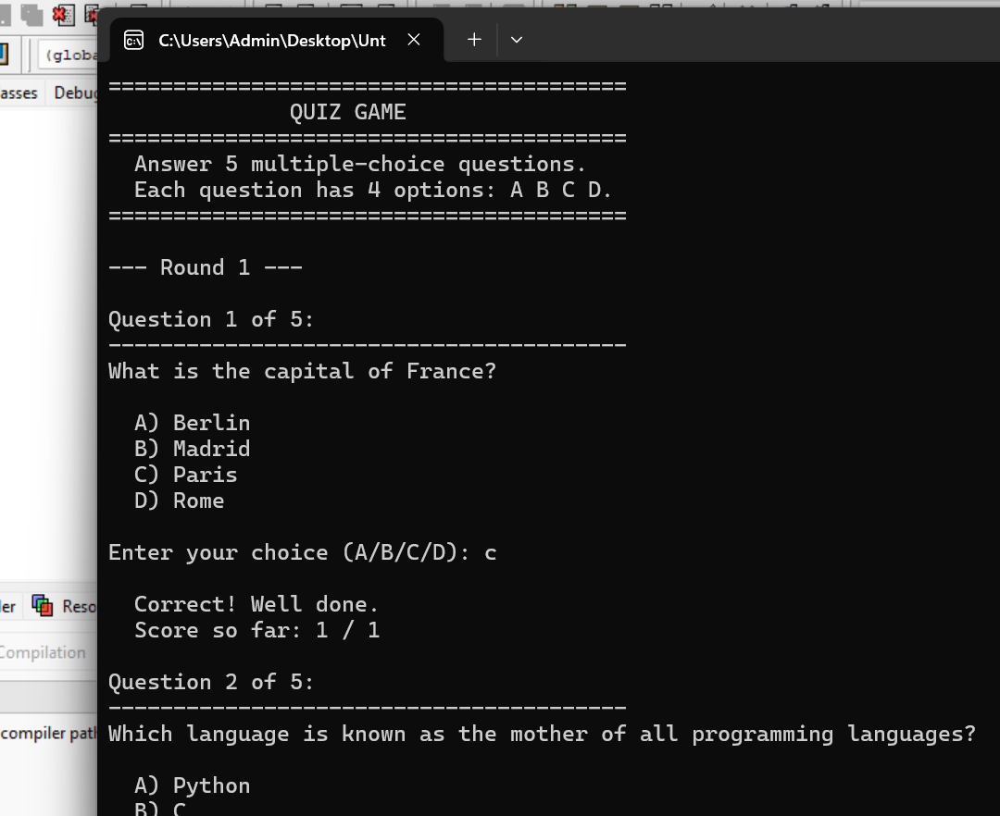
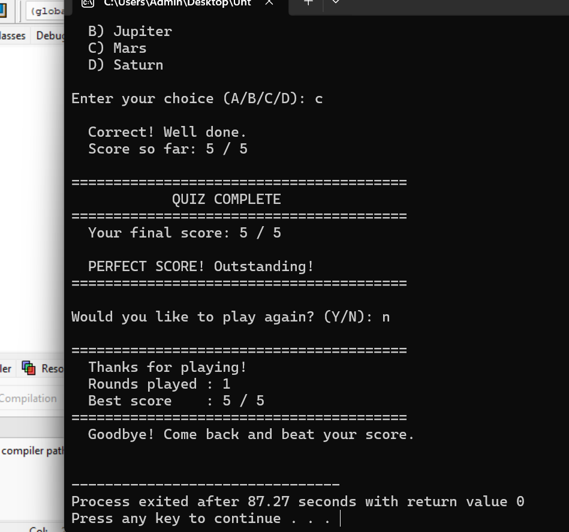

# Quiz Game in C

A console-based multiple-choice quiz game built in C. The computer asks you 5 general knowledge questions, gives instant feedback on every answer, tracks your score, and lets you replay to beat your best.

---

## Screenshots





---

## Why I Built This

After finishing my Number Guessing Game, I wanted to take the next step — a project that introduced structs, arrays of data, and more complex game logic. This quiz game taught me how to organize related data together using `typedef struct` and how to build a program that feels complete and polished.

I built it commit by commit, one feature at a time, the same way I approach every project.

---

## What the Game Does

- Asks 5 multiple-choice general knowledge questions
- Each question has 4 options: A, B, C, or D
- Gives instant correct or wrong feedback after every answer
- Shows the running score after each question
- Displays a final score summary with tiered feedback
- Rejects invalid input — letters outside A-D, numbers, symbols
- Asks if you want to replay and tracks your best score across all rounds

---

## How to Run It

**You need GCC installed. Check with:**
```bash
gcc --version
```

**Compile:**
```bash
gcc quiz_game.c -o quiz_game
```

**Run:**
```bash
./quiz_game
```

---

## How I Built It — 4 Commit History

**Commit 1 — Project setup**
Created `quiz_game.c`, wrote `main()`, and printed the welcome banner. Same first step I take on every project — get the structure right before writing any logic.

**Commit 2 — Question struct, display, and input validation**
This was the most educational commit. Introduced `typedef struct` to group a question's text, four options, and correct answer into one unit. Built the full `quiz[]` question bank, wrote `display_question()` to print each question cleanly, and wrote `get_valid_choice()` with `clear_input_buffer()` to handle all input safely. Tested with a single question and debug output before moving on.

**Commit 3 — Quiz loop, answer checking, and scoring**
Added `run_quiz()` — the core of the game. It loops through every question, reads the player's answer, compares it to the correct answer, prints instant feedback including the correct answer on wrong guesses, and shows a running score after every question. Removed the debug code. The game was fully playable for the first time.

**Commit 4 — Replay, final summary, and best score**
Added `show_final_score()` with five tiered feedback messages based on performance. Added `ask_play_again()` with Y/N validation. Wrapped everything in a `do-while` loop in `main()`. Added a best score tracker that remembers your highest score across all rounds in a session.

---

## What I Learned

**`typedef struct`** — the biggest new concept in this project. Grouping `question`, `options[]`, and `answer` into one `Question` struct made the code clean and easy to extend. Adding a new question is just adding one block to the array.

**Pointer to struct** — `display_question()` takes `const Question *q` instead of a copy. This is more efficient and the right habit to build early.

**`toupper()` from `ctype.h`** — lets the player type `a`, `b`, `c`, or `d` in lowercase and the program handles it without any extra code on the player's side. Small detail, big difference in feel.

**Separating logic into functions** — `run_quiz()` does one job, `show_final_score()` does one job, `ask_play_again()` does one job. `main()` just connects them. This made the code easy to read and easy to debug.

**Building incrementally** — each commit was a working version. I never had a broken program sitting on GitHub. That discipline matters.

---

## Project Structure

```
quiz-game-c/
├── quiz_game.c
├── README.md
└── screenshots/
    ├── gameplay.png
    └── final-score.png
```

---

## Tech

- **Language:** C (C99)
- **Compiler:** GCC
- **Libraries:** `stdio.h`, `ctype.h` — standard library only, no external dependencies

---

## Connect

[](https://www.linkedin.com/in/muhammad-ramzan-bb63233aa/)
[](mailto:mramzan14700@gmail.com)

---

*Built commit by commit as part of learning C fundamentals. Still Learning, Still Building.*